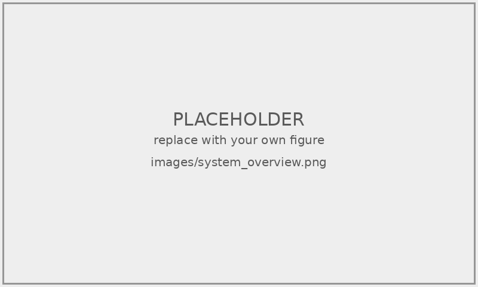

<!-- ============================================================ -->
<!-- 封面版型（格式規範附件1、圖資處封面範例檔）：封面與書名頁共用 -->
<!-- 中文 18／16 號楷書、英文 16 號 Times New Roman，皆 1.5 倍行高 -->
<!-- ============================================================ -->

```{=latex}
\newcommand{\NsysuCover}{%
\begin{titlepage}
\linespread{1.5}% 封面各行 1.5 倍行高，不受 YAML linestretch 影響
\begin{center}
{\fontsize{18pt}{21.6pt}\selectfont \UniversityZh\Department\par
\Degree\par}
{\fontsize{16pt}{19.2pt}\selectfont \DepartmentEn\par
National Sun Yat-sen University\par
\DegreeEn\par}
\vfill
{\fontsize{18pt}{21.6pt}\selectfont \ThesisTitleZh\par}
{\fontsize{16pt}{19.2pt}\selectfont \ThesisTitleEn\par}
\vfill
{\fontsize{16pt}{19.2pt}\selectfont 研究生：\StudentName\par
\StudentNameEn\par
\vspace{12pt}
指導教授：\AdvisorName\par
\AdvisorNameEn\par}
\vfill
{\fontsize{16pt}{19.2pt}\selectfont 中華民國\ROCYear 年\ROCMonth 月\par
\MonthYearEn\par}
\end{center}
\end{titlepage}}
```

<!-- 封面（無頁碼；電子檔不需書脊） -->

\NsysuCover

<!-- 書名頁：與封面同（格式規範第五點） -->

\NsysuCover

<!-- ============================================================ -->
<!-- 正文前各頁：小寫羅馬數字頁碼 i, ii, iii ...（第十五點） -->
<!-- ============================================================ -->

\pagenumbering{roman}
\pagestyle{frontmatter}

<!-- 論文審定書（附件2）：口試通過、指導教授簽章後，以掃描檔替換此頁，例如 -->
<!-- \noindent\includegraphics[width=\textwidth]{images/approval.pdf} -->

\section*{論文審定書}
\phantomsection
\addcontentsline{toc}{section}{論文審定書}

\begin{center}
<請以簽章完成的論文審定書掃描檔替換此頁>
\end{center}

\newpage

<!-- 論文公開授權書（附件3）：紙本論文裝訂在此處；圖資處說明電子檔不需放公開授權書 -->

<!-- 序言或誌謝（選填，原則不超過一頁） -->

\section*{誌謝}
\phantomsection
\addcontentsline{toc}{section}{誌謝}

<請在此撰寫誌謝詞，以不超過一頁為原則。>

\newpage

<!-- 中文摘要（附件4：一頁為原則，關鍵詞 5–7 個列於內文下方） -->

\section*{摘\quad 要}
\phantomsection
\addcontentsline{toc}{section}{中文摘要}

<請在此撰寫中文摘要，以一頁為原則。內容應論述重點，包括研究目的、研究方法、程序及結論等。>

\vspace{1cm}

\noindent 關鍵詞：<關鍵詞 1>、<關鍵詞 2>、<關鍵詞 3>、<關鍵詞 4>、<關鍵詞 5>

\newpage

<!-- 英文摘要（以英文撰寫的論文仍需附中文摘要） -->

\section*{Abstract}
\phantomsection
\addcontentsline{toc}{section}{英文摘要}

<Write the English abstract here, one page in principle. It should mirror the Chinese abstract.>

\vspace{1cm}

\noindent Keywords: <Keyword 1>, <Keyword 2>, <Keyword 3>, <Keyword 4>, <Keyword 5>

\newpage

<!-- 目錄（附件5） -->

\tableofcontents

\newpage

<!-- 圖次、表次（附件6） -->

\listoffigures

\newpage

\listoftables

\newpage

<!-- 符號說明（選填）：取消註解使用 -->
<!--
\section*{符號說明}
\phantomsection
\addcontentsline{toc}{section}{符號說明}

\newpage
-->

<!-- ============================================================ -->
<!-- 正文首頁起至附錄：阿拉伯數字頁碼 1, 2, 3 ...（第十五點） -->
<!-- ============================================================ -->

\pagenumbering{arabic}
\pagestyle{mainmatter}

# 緒論 {#sec:intro}

## 研究背景 {#sec:intro-background}

<請在此撰寫研究背景。簡述問題領域的現況、重要性，以及為什麼這個題目值得研究。可引用文獻：[@vaswani2017attention]。>

## 研究動機與目的 {#sec:intro-motivation}

<請說明研究動機（觀察到什麼問題、現有方法的不足）與研究目的（你想解決什麼、達成什麼）。>

## 研究貢獻 {#sec:intro-contribution}

<請條列本論文的主要貢獻，建議 2-4 點。>

1. **<貢獻一，請替換>**：<簡述貢獻內容，請替換>
2. **<貢獻二，請替換>**：<簡述貢獻內容，請替換>
3. **<貢獻三，請替換>**：<簡述貢獻內容，請替換>

## 論文架構 {#sec:intro-structure}

本論文共分為五章。第\ref{sec:literature}章回顧相關文獻；第\ref{sec:method}章說明所提方法；第\ref{sec:results}章呈現實驗結果與討論；第\ref{sec:conclusion}章總結本研究並提出未來工作方向。

# 文獻探討 {#sec:literature}

## 相關主題一 {#sec:literature-topic1}

<請在此回顧該主題的相關研究。引用文獻範例：[@vaswani2017attention; @he2016resnet]。>

## 相關主題二 {#sec:literature-topic2}

<請在此回顧另一個主題的相關研究。>

## 小結 {#sec:literature-summary}

<簡述文獻回顧的整體發現，以及本研究與既有研究的差異。>

# 研究方法 {#sec:method}

## 系統概述 {#sec:method-overview}

<請說明你的方法整體架構。可插入系統流程圖：>

<!--
範例：插入單張圖片（圖名在圖下方；擷取自文獻的圖，須在圖下方標註資料來源）

{#fig:system-overview width=80%}

範例：插入單張大圖（精確控制尺寸）
\begin{figure}[!htbp]
\centering
\includegraphics[width=1\textwidth,height=0.9\textheight,keepaspectratio]{images/system_overview.png}
\caption{系統架構流程}
\label{fig:system-overview}
\end{figure}
-->

如圖\ref{fig:system-overview}所示，本研究的整體架構分為三個主要模組。

## 方法一 {#sec:method-approach1}

<請說明第一個方法元件的細節。可插入公式：>

公式\ref{eq:example-formula}定義了核心運算：

\begin{equation}
y = f(x; \theta) + \epsilon
\label{eq:example-formula}
\end{equation}

## 方法二 {#sec:method-approach2}

<請說明第二個方法元件。>

# 實驗結果與討論 {#sec:results}

## 實驗設定 {#sec:results-setup}

<請說明：資料集、評估指標、實驗環境、超參數設定。可用表格呈現：>

<!--
範例 LaTeX 表格（表名在表上方；擷取自文獻的表，須在表下方標註資料來源）：
\begin{table}[htbp]
\centering
\caption{實驗超參數設定}
\label{tab:hyperparameters}
\small
\begin{tabular}{ll}
\hline
\textbf{超參數} & \textbf{值} \\
\hline
學習率 (Learning Rate) & 1e-4 \\
批次大小 (Batch Size)  & 32 \\
訓練週期 (Epochs)      & 100 \\
最佳化器 (Optimizer)   & AdamW \\
\hline
\end{tabular}
\end{table}
-->

實驗超參數設定如表\ref{tab:hyperparameters}所示。

## 主要結果 {#sec:results-main}

<請呈現主要實驗結果。建議搭配表格與圖表。>

## 消融研究 {#sec:results-ablation}

<請說明各元件對性能的貢獻。>

## 討論 {#sec:results-discussion}

<請分析結果背後的意義、與現有方法的比較、模型的限制等。>

# 結論與未來工作 {#sec:conclusion}

## 結論 {#sec:conclusion-summary}

<請總結本論文的研究成果與貢獻。>

## 未來工作 {#sec:conclusion-future}

<請說明本研究可能的延伸方向。>

<!-- ============================================================ -->
<!-- 參考文獻（Pandoc + biblatex 自動產生，列入目錄） -->
<!-- ============================================================ -->

\newpage
\printbibliography[title=參考文獻, heading=bibintoc]

<!-- 附錄（選填）、自傳或簡歷（選填，勿放生日、身分證字號、電話、住址等個資） -->
